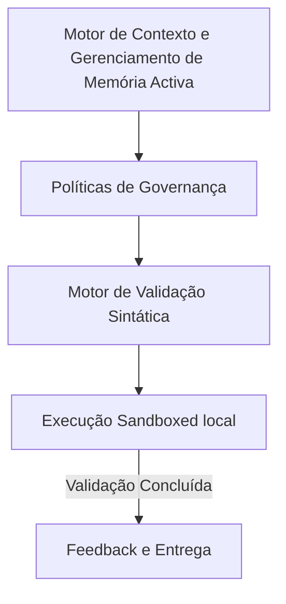

# 02-context-engine - Arquitetura de Motor de Contexto e Gerenciamento de Memória Activa

## 🏛️ Visão Estrutural e Arquitetural

O Context Engine gerencia o fluxo de contexto do agente. Ele organiza o contexto em três níveis operacionais:
1. **Contexto Imediato (Short-Term)**: Contido no prompt e nos arquivos abertos na IDE.
2. **Contexto Semântico (Semantic Retrieval)**: Carregado sob demanda utilizando busca vetorial em banco de dados local.
3. **Contexto Consolidado (Long-Term)**: Preservado em arquivos `.md` e indexes semânticos do projeto.

### 📐 Diagrama de Fluxo e Componentes Semânticos

---

## 🛡️ Guardrails e Integridade Estrutural
Toda alteração de arquitetura sob este domínio deve respeitar os seguintes guardrails:
1.  **Imutabilidade Sintática**: Nenhuma estrutura de pasta interna pode ser criada sem a prévia validação sintática do linter do repositório.
2.  **Clean Architecture**: Seguir o isolamento de dependências, garantindo que as regras de negócio nunca dependam de implementações físicas ou frameworks temporários.
3.  **Visual DNA Consistency**: Integração contínua com especificações visuais para impedir desalinhamento estético em interfaces (Vibe Checking).

---

> [!IMPORTANT]
> **Soberania da Arquitetura:**
> Esta especificação técnica deve ser mantida livre de alucinações. Alterações nesta estrutura devem ser registradas exclusivamente através de ADRs (Architecture Decision Records) aprovadas pelo supervisor de engenharia humano.
