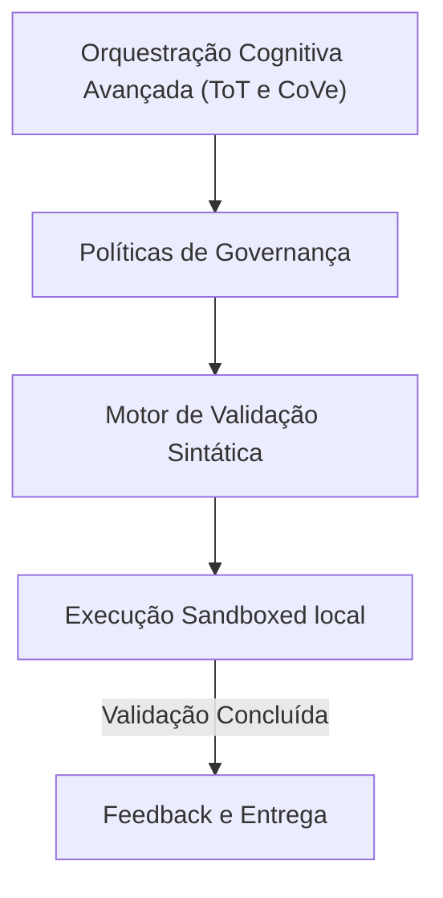

# 07-ai-orchestration - Arquitetura de Orquestração Cognitiva Avançada (ToT e CoVe)

## 🏛️ Visão Estrutural e Arquitetural

Esta camada coordena o motor de inferência da IA, saindo do processamento linear (Sistema 1) para a cognição de alta fidelidade (Sistema 2).
Ela organiza a árvore de decisão do agente gerando caminhos de raciocínio lógico que são avaliados por testes unitários locais antes da entrega.

### 📐 Diagrama de Fluxo e Componentes Semânticos

---

## 🛡️ Guardrails e Integridade Estrutural
Toda alteração de arquitetura sob este domínio deve respeitar os seguintes guardrails:
1.  **Imutabilidade Sintática**: Nenhuma estrutura de pasta interna pode ser criada sem a prévia validação sintática do linter do repositório.
2.  **Clean Architecture**: Seguir o isolamento de dependências, garantindo que as regras de negócio nunca dependam de implementações físicas ou frameworks temporários.
3.  **Visual DNA Consistency**: Integração contínua com especificações visuais para impedir desalinhamento estético em interfaces (Vibe Checking).

---

> [!IMPORTANT]
> **Soberania da Arquitetura:**
> Esta especificação técnica deve ser mantida livre de alucinações. Alterações nesta estrutura devem ser registradas exclusivamente através de ADRs (Architecture Decision Records) aprovadas pelo supervisor de engenharia humano.
