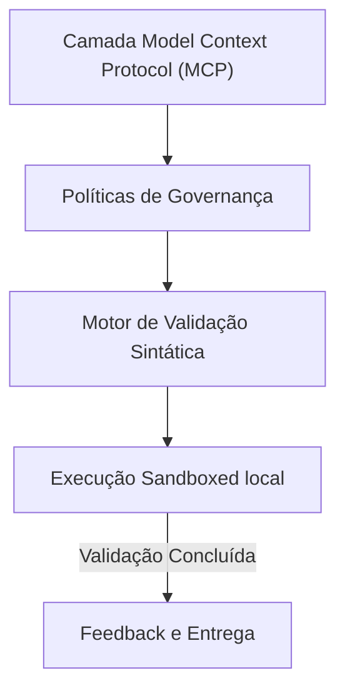

# 11-mcp-layer - Arquitetura de Camada Model Context Protocol (MCP)

## 🏛️ Visão Estrutural e Arquitetural

A camada MCP funciona como a fronteira de interoperabilidade do agente de IA (o 'USB-C de ferramentas de IA').
Ela organiza conectores, adaptadores e esquemas de dados em sub-pastas dedicadas, abstraindo as APIs sob a especificação MCP padrão.

### 📐 Diagrama de Fluxo e Componentes Semânticos

---

## 🛡️ Guardrails e Integridade Estrutural
Toda alteração de arquitetura sob este domínio deve respeitar os seguintes guardrails:
1.  **Imutabilidade Sintática**: Nenhuma estrutura de pasta interna pode ser criada sem a prévia validação sintática do linter do repositório.
2.  **Clean Architecture**: Seguir o isolamento de dependências, garantindo que as regras de negócio nunca dependam de implementações físicas ou frameworks temporários.
3.  **Visual DNA Consistency**: Integração contínua com especificações visuais para impedir desalinhamento estético em interfaces (Vibe Checking).

---

> [!IMPORTANT]
> **Soberania da Arquitetura:**
> Esta especificação técnica deve ser mantida livre de alucinações. Alterações nesta estrutura devem ser registradas exclusivamente através de ADRs (Architecture Decision Records) aprovadas pelo supervisor de engenharia humano.
