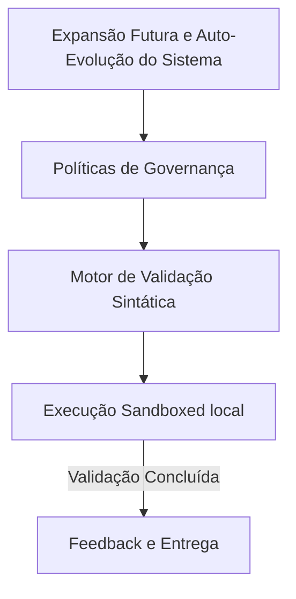

# 17-future-expansion - Arquitetura de Expansão Futura e Auto-Evolução do Sistema

## 🏛️ Visão Estrutural e Arquitetural

A camada de Expansão Futura é a ponte de evolução do sistema.
Ela define a estrutura de acoplamento de novos módulos de governança e novosSwarm de agentes, prevendo suporte a novas redes LLM de contexto infinito.

### 📐 Diagrama de Fluxo e Componentes Semânticos

---

## 🛡️ Guardrails e Integridade Estrutural
Toda alteração de arquitetura sob este domínio deve respeitar os seguintes guardrails:
1.  **Imutabilidade Sintática**: Nenhuma estrutura de pasta interna pode ser criada sem a prévia validação sintática do linter do repositório.
2.  **Clean Architecture**: Seguir o isolamento de dependências, garantindo que as regras de negócio nunca dependam de implementações físicas ou frameworks temporários.
3.  **Visual DNA Consistency**: Integração contínua com especificações visuais para impedir desalinhamento estético em interfaces (Vibe Checking).

---

> [!IMPORTANT]
> **Soberania da Arquitetura:**
> Esta especificação técnica deve ser mantida livre de alucinações. Alterações nesta estrutura devem ser registradas exclusivamente através de ADRs (Architecture Decision Records) aprovadas pelo supervisor de engenharia humano.
