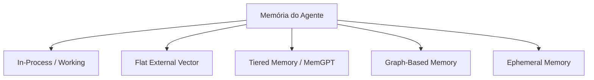

# Topologias de Memória para Agentes (Benchmark LOCOMO 2026)

Este documento estabelece as diretrizes arquiteturais para o design de sistemas de armazenamento, persistência e recuperação de informações nos agentes do ecossistema `agente-core`. A seleção correta da topologia de memória impacta diretamente o Retorno sobre Investimento (ROI), a latência do sistema e a conformidade regulatória.

---

## 1. O Desafio do "Instruction Budget" e do TCO

Modelos de linguagem modernos operam sob restrições severas de orçamento de processamento (*Instruction Budget*). Modelos de fronteira apresentam eficiência máxima de raciocínio logicamente delimitada a cerca de **150 a 200 instruções concorrentes** na janela de contexto antes de sofrerem degradação de atenção (*Context Rot*).

Inundar a janela de contexto com instruções estáticas (como o inchaço inadequado de regras imutáveis nos arquivos de configuração do agente) é financeiramente e operacionalmente ineficiente.

> [!TIP]
> **Dados de Benchmark LOCOMO 2026**:
> *   **Abordagem In-Process (Janela Completa)**: Consome em média **26.031 tokens** por interação básica em conversas longas, resultando em latências elevadas de até **17.12s (p95)** — o que inviabiliza interfaces em tempo real.
> *   **Abordagem de Memória Seletiva**: Reduz o consumo para cerca de **1.764 tokens** por interação (economia de até **90% em tokens** e corte substancial na latência operacional).

---

## 2. As 5 Topologias Lógicas de Memória

Para estruturar a persistência de forma eficiente, dividimos a arquitetura de memória dos agentes em cinco camadas estruturais:

### 1. In-Process / Working-Only (Memória de Trabalho)
*   **Substrato:** A janela de contexto imediata do LLM (*System prompt* + histórico de chat).
*   **Prós:** Resposta instantânea, fácil implementação, e aderência direta para tarefas de escopo curto e linear.
*   **Contras:** Efeito *Lost-in-the-Middle* em chats longos; custo proibitivo cumulativo; desaparece por completo ao resetar a sessão de execução do agente.

### 2. Flat External Vector Store (Memória Semântica)
*   **Substrato:** Banco de dados vetoriais desacoplados (ex: pgvector, Pinecone).
*   **Prós:** Persistência ilimitada a custos baixos, pesquisa ágil baseada em similaridade de cosseno.
*   **Contras:** Perda de relações estruturais, temporais e de dependência sintática. Risco elevado de alucinação de dados que são semanticamente próximos, mas contextualmente irrelevantes.

### 3. Tiered Memory (Memória Hierárquica / MemGPT / Letta)
*   **Substrato:** Paginação inteligente e orquestração de memória física em níveis (L1/L2 Cache em contexto, RAM externa e armazenamento permanente em disco).
*   **Prós:** O agente gerencia sua própria memória em tempo de execução via *tool calls* de leitura/escrita, viabilizando conversas com histórico perpétuo.
*   **Contras:** Elevada complexidade de engenharia e potencial aumento da latência devido a chamadas de múltiplos passos de paginação.

### 4. Graph-Based Memory (Memória Relacional)
*   **Substrato:** Bancos de grafos semânticos e mapas de conhecimento (ex: Neo4j, ontologias estruturadas).
*   **Prós:** Preserva relações de dependência, rastreamento temporal preciso de entidades e a árvore genealógica de decisões complexas de engenharia.
*   **Contras:** Alta intensidade computacional na indexação de novos nós de conhecimento e na escrita de queries de busca.

### 5. Ephemeral Memory (Memória Volátil de Runtime)
*   **Substrato:** Variáveis locais em runtime de execução, Redis temporário indexado por ID de sessão de API.
*   **Prós:** Isolamento absoluto de segurança contra *prompt injections* persistentes; apagada de forma autônoma após a conclusão do ciclo de execução.
*   **Contras:** Incapacidade de aprender comportamentos ou reter fatos essenciais para execuções e dias subsequentes.

---

## 3. Matriz Comparativa de Topologias

| Topologia de Memória | Latência p95 | Eficiência de Token | Complexidade | Caso de Uso Ideal |
| :--- | :--- | :--- | :--- | :--- |
| **In-Process** | 17.12s (Alta em sessões longas) | Baixa (Inchaço) | Baixa | Tarefas de script únicas (*one-off scripts*). |
| **Flat Vector** | 1.20s | Média | Média | Recuperação de documentações de referência (RAG). |
| **Tiered Memory** | 3.50s | Alta | Alta | Chatbots persistentes de suporte ou agentes pessoais. |
| **Graph-Based** | 2.10s | Alta | Muito Alta | Análise de impacto e dependência de código complexo. |
| **Ephemeral** | <0.10s | Muito Alta | Baixa | Fluxos de autenticação temporária e sanboxing de comandos. |

---

## 4. Governança e Conformidade Regulatória

O armazenamento de dados em memórias externas de longo prazo (*Flat Vector*, *Tiered* e *Graph-Based*) deve respeitar estritamente as diretrizes de privacidade do **EU AI Act** e os princípios do **NIST AI RMF**:
1.  **Linhagem de Dados (Lineage Maps):** Manutenção detalhada e auditável da origem e das transformações aplicadas aos dados salvos na memória do agente.
2.  **Direito ao Esquecimento:** Mecanismos programáticos que permitam apagar com segurança registros específicos da memória semântica e relacional dos agentes a pedido do usuário.
3.  **Auditoria de Alinhamento:** Varreduras automáticas para identificar e podar memórias do agente que apresentem comportamento tendencioso ou desvios de segurança.
