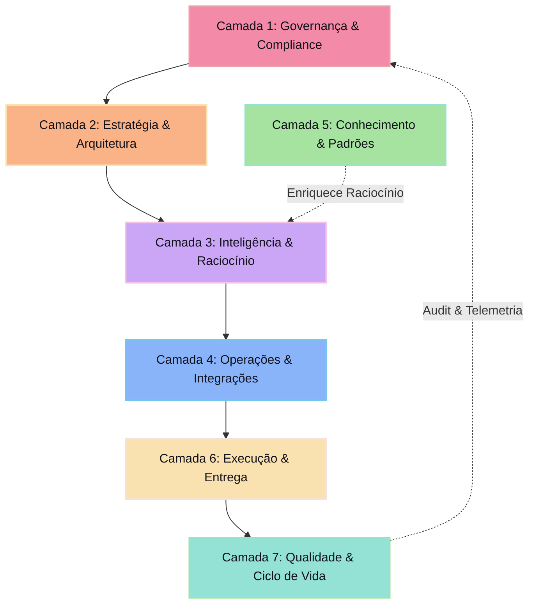

# 🌳 [SEMANTIC TREE] — Mapa de Conexões e Topologia Semântica

Este documento estabelece a topologia semântica do repositório `agente-core`. A reestruturação substitui a organização antiga em numeração sequencial por 28 categorias enterprise agrupadas em 7 camadas lógicas de alta coesão e baixo acoplamento.

---

## 🏛️ Camadas Arquiteturais e Distribuição Semântica

Para fins de governança, governabilidade e eficiência de raciocínio de IA, as 28 pastas semânticas do ecossistema são categorizadas em **7 Camadas Arquiteturais**:

---

## 📂 Detalhamento das 7 Camadas Lógicas

### 1. Camada de Governança & Compliance (Layer 1)
Fornece os limites éticos, regras sintáticas e leis operacionais que nenhum agente ou desenvolvedor pode violar.
- [/governance](file:///c:/Dev/agente-core/governance) — Modelos de conformidade, leis constitucionais do framework e diretrizes de supervisão humana.
- [/rules](file:///c:/Dev/agente-core/rules) — Instruções executáveis de IA, regras semânticas por tecnologia e triggers operacionais.
- [/standards](file:///c:/Dev/agente-core/standards) — Convenções de codificação, padrões de formatação, guias de nomenclatura e guias de estilo.
- [/technical-decisions](file:///c:/Dev/agente-core/technical-decisions) — Registro histórico e formal de decisões arquiteturais (ADRs).

### 2. Camada de Estratégia & Arquitetura (Layer 2)
Define a topologia do ecossistema, os caminhos de execução operacional e as metas de evolução de longo prazo.
- [/architecture](file:///c:/Dev/agente-core/architecture) — Blueprints de infraestrutura, diagramas de fluxo e mapas semânticos (SSOT).
- [/execution-flows](file:///c:/Dev/agente-core/execution-flows) — Roteiros táticos de execução, sequenciadores de tarefas e workflows de compilação.
- [/roadmaps](file:///c:/Dev/agente-core/roadmaps) — Metas de expansão futura, horizontes de migração de stack e evolução do motor.

### 3. Camada de Inteligência & Raciocínio (Layer 3)
Contém os modelos cognitivos, perfis de personas e os motores de contexto/memória que alimentam a IA.
- [/ai-systems](file:///c:/Dev/agente-core/ai-systems) — Configurações de LLMs, definições de agentes autônomos e arquiteturas cognitivas.
- [/prompts](file:///c:/Dev/agente-core/prompts) — Biblioteca estruturada de prompts do sistema, templates de prompts dinâmicos e definições de persona.
- [/context-maps](file:///c:/Dev/agente-core/context-maps) — Motores de indexação de contexto, partições de memória de longo prazo e esquemas de dados semânticos.

### 4. Camada de Operações & Integrações (Layer 4)
Garante a conectividade entre os modelos cognitivos e o mundo físico por meio de ferramentas, automações e APIs.
- [/mcp-integrations](file:///c:/Dev/agente-core/mcp-integrations) — Configurações do Model Context Protocol, servidores MCP e extensões de ferramentas.
- [/integrations](file:///c:/Dev/agente-core/integrations) — Conectores externos, clientes de API de terceiros e serviços de nuvem integrados.
- [/automations](file:///c:/Dev/agente-core/automations) — Scripts de automação rotineira, cronjobs de sincronização e pipelines de dados.
- [/internal-tools](file:///c:/Dev/agente-core/internal-tools) — Ferramentas internas em CLI, utilitários locais e helpers de desenvolvimento.

### 5. Camada de Conhecimento & Padrões (Layer 5)
A base de conhecimento rica e os padrões reusáveis de engenharia estruturados para consulta rápida e enriquecimento de contexto.
- [/knowledge-base](file:///c:/Dev/agente-core/knowledge-base) — Enciclopédias de domínio, guias técnicos consolidados e documentação destilada de setor.
- [/patterns](file:///c:/Dev/agente-core/patterns) — Padrões de design de código (GOF, Clean Code), paradigmas de engenharia e blueprints de código.
- [/references](file:///c:/Dev/agente-core/references) — Dicionários de termos, links e glossários técnicos.
- [/playbooks](file:///c:/Dev/agente-core/playbooks) — Guias passo a passo para incidentes, manuais de mitigação de crises e roteiros de resolução de bugs.

### 6. Camada de Execução & Entrega (Layer 6)
Contém as reais habilidades (skills) modulares, os códigos de teste e os esqueletos que formam a entrega final do framework.
- [/modules](file:///c:/Dev/agente-core/modules) — O catálogo modular contendo todas as mais de 1.300 competências de desenvolvimento.
- [/templates](file:///c:/Dev/agente-core/templates) — Scaffolds reutilizáveis, boilerplates estruturais e skeletons prontos para uso.
- [/examples](file:///c:/Dev/agente-core/examples) — Aplicações de demonstração, laboratórios de código e casos de uso de referência.
- [/workflows](file:///c:/Dev/agente-core/workflows) — Sequenciadores de pipeline e orquestrações de fluxos de CI/CD corporativos.

### 7. Camada de Qualidade & Ciclo de Vida (Layer 7)
Mede, monitora, valida a saúde técnica e facilita a entrada de novas pessoas e processos no framework.
- [/audits](file:///c:/Dev/agente-core/audits) — Resultados de auditoria interna, verificações de segurança técnica e relatórios de conformidade.
- [/diagnostics](file:///c:/Dev/agente-core/diagnostics) — Dashboards de telemetria, logs de erro históricos e métricas de desempenho.
- [/onboarding](file:///c:/Dev/agente-core/onboarding) — Guias de setup inicial para humanos, ferramentas locais e preparação do ambiente.
- [/operational-guides](file:///c:/Dev/agente-core/operational-guides) — Manuais do framework e guias operacionais cotidianos.
- [/documentation](file:///c:/Dev/agente-core/documentation) — Documentações gerais, release notes e FAQs do ecossistema.
- [/assets](file:///c:/Dev/agente-core/assets) — Mídias, logotipos, fontes e componentes visuais do framework.

---

## 🔄 Direcionalidade do Fluxo Semântico

No repositório reestruturado, a comunicação segue um modelo estrito de fluxo unidirecional para preservar a pureza arquitetural:

1.  **Validação Descendente**: As camadas superiores (`Camada 1` e `Camada 2`) sempre regulam e parametrizam o comportamento das inferiores.
2.  **Enriquecimento Ascendente**: O aprendizado gerado pelas camadas de execução (`Camada 6` e `Camada 7`) alimenta continuamente a base de conhecimento (`Camada 5`) e gera revisões em forma de decisões técnicas (`Camada 1 / technical-decisions`).
3.  **Isolamento de Estado**: Ferramentas operacionais (`Camada 4`) não possuem estado cognitivo. Elas apenas executam ações solicitadas pela camada de inteligência (`Camada 3`), consumindo dados formatados de acordo com os limites semânticos (`Camada 1`).
