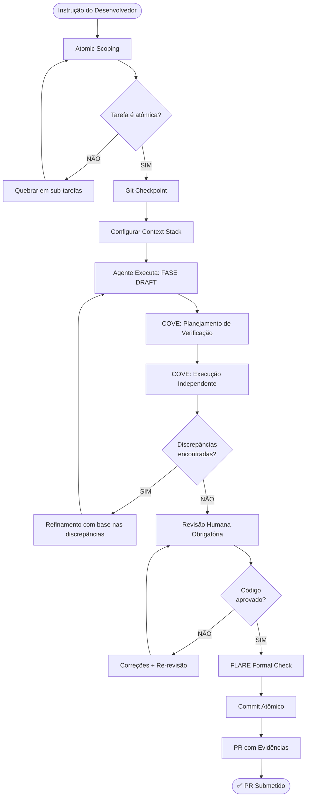

# 📋 EXECUTION FLOW: PR Agêntico — Protocolo de Pull Request com IA

> **Padrão:** Governança de Engenharia Agêntica 2026  
> **Tipo:** Checklist Operacional + Fluxo de Decisão  
> **Versão:** 1.0 | 2026

---

## ⚠️ LEI FUNDAMENTAL

> **É terminantemente proibido submeter PRs com código não revisado pelo autor.**  
> "Se o autor não validou o código, o revisor poderia simplesmente ter rodado o prompt original."  
> — Simon Willison

---

## 1. Fluxo Completo: Do Prompt ao PR Aprovado



---

## 2. Checklist Pré-PR Obrigatório

### 2.1 Atomicidade e Escopo

```
□ O PR resolve UMA única unidade lógica de trabalho?
□ Cada commit é independente e explica seu próprio propósito?
□ Nenhum arquivo não relacionado foi modificado?
□ A branch segue o padrão: feat/|fix/|refactor/|docs/
```

### 2.2 Qualidade do Código Gerado por IA

```
□ O autor LEU linha a linha todo o código gerado?
□ Todas as funções/APIs/imports foram verificados no codebase real?
□ Nenhuma lógica está "alucinada" ou copiada de memória incorreta?
□ A implementação segue a Clean Architecture do projeto?
□ Cobertura de testes ≥ 80%?
```

### 2.3 Descrição do PR

```
□ Título claro e não gerado por IA sem edição humana?
□ Contexto do "por quê" da mudança explicado?
□ Link para issue/ticket correspondente?
□ Lista de arquivos modificados com justificativa?
□ Breaking changes explicitamente documentados?
```

### 2.4 Evidências de Validação Manual

```
□ Screenshot ou vídeo demonstrando o funcionamento?
□ Logs de execução de testes incluídos?
□ Resultado de linting/typecheck incluído?
□ Teste manual em ambiente de desenvolvimento confirmado?
```

---

## 3. Protocolo COVE para PRs (Execução Fatorada)

O **Chain-of-Verification** para PRs funciona de forma **fatorada** — a verificação é INDEPENDENTE do rascunho:

### Fase 1: Rascunho (Draft)
```
→ Agente gera a implementação inicial normalmente
→ NÃO mostre ao agente o contexto de verificação ainda
```

### Fase 2: Planejamento de Verificação
```
Prompt separado (nova interação):
"Dado este código [cole o draft], liste:
 1. Todas as funções externas utilizadas
 2. Todos os imports e suas origens
 3. Todas as APIs/endpoints chamados
 4. Todos os tipos/interfaces referenciados"
```

### Fase 3: Execução Independente (CRÍTICA)
```
Novo prompt ISOLADO (sem ver o rascunho original):
"Para cada item da lista abaixo, verifique no codebase:
 [lista da fase 2]
 Responda: EXISTS | NOT_FOUND | WRONG_SIGNATURE"
 
⚠️ IMPORTANTE: Esta fase DEVE ser em sessão separada
   para eliminar viés de confirmação do rascunho
```

### Fase 4: Refinamento
```
"Reescreva o código corrigindo todos os itens NOT_FOUND 
 e WRONG_SIGNATURE com as implementações reais do codebase.
 Para cada correção, explique o que foi mudado e por quê."
```

---

## 4. Padrão de Commit para PRs Agênticos

```bash
# Formato: <tipo>(<escopo>): <descrição>
# 
# Tipos válidos: feat|fix|refactor|docs|test|chore|style
# Escopo: módulo ou área afetada
#
# Exemplo de commit atômico validado:

feat(auth): add rate limiting to AuthService

- Implement sliding window rate limiter (100 req/min)
- Add Redis-backed counter with TTL expiration
- Include unit tests for edge cases (burst, reset)
- Closes #247

AI-Assisted: Yes | Human-Reviewed: ✅ | COVE: ✅

# ⛔ ANTIPADRÕES PROIBIDOS:
# "feat: updates"
# "fix: various fixes"
# "wip: work in progress"
# Commits com 50+ arquivos modificados
```

---

## 5. Template de Descrição de PR

```markdown
## 📋 O Que Foi Feito
[Descrição técnica concisa — EDITADA pelo autor, não copiada da IA]

## 🎯 Por Que Foi Feito
[Link para issue: #123 | Contexto de negócio]

## 🔧 Como Foi Implementado
- [Decisão de design 1 e justificativa]
- [Decisão de design 2 e justificativa]

## ✅ Evidências de Validação
- [ ] Testes unitários passando (screenshot/log)
- [ ] Teste manual executado (vídeo/screenshot)
- [ ] Linting sem erros
- [ ] TypeCheck sem erros

## 🤖 Uso de IA
- IA Utilizada: Antigravity / Claude Code / outro
- COVE Executado: ✅
- Revisão Humana Linha-a-Linha: ✅
- Código não revisado presente: NÃO

## ⚠️ Breaking Changes
[NENHUM | Lista de breaking changes]

## 📝 Notas para Reviewer
[O que o reviewer deve prestar mais atenção]
```

---

## 6. Regras de Git Governance para IA

```
BRANCHES:
  main/master     → Protegida, merge apenas via PR aprovado
  develop         → Branch de integração
  feat/[nome]     → Features novas
  fix/[nome]      → Correções
  refactor/[nome] → Refatorações sem mudança funcional
  docs/[nome]     → Apenas documentação

PROTEÇÕES OBRIGATÓRIAS:
  □ Require pull request reviews (mínimo 1)
  □ Dismiss stale reviews on new push
  □ Require status checks (CI) to pass
  □ Require branches to be up to date
  □ Restrict force pushes (nunca em main)

COMMITS:
  □ Conventional Commits obrigatório
  □ Mensagens em inglês
  □ Corpo do commit em pt-BR permitido
  □ Referência ao issue obrigatória (Closes #N)
```

---

> **Referências:**  
> - *Protocolo Operacional: Governança de Engenharia Agêntica e Pull Requests de IA*  
> - *Engenharia de Prompts 2.0: Do Ad Hoc à Engenharia de Precisão Baseada em Dados*  
> da biblioteca `c:\Dev\Docs\`
