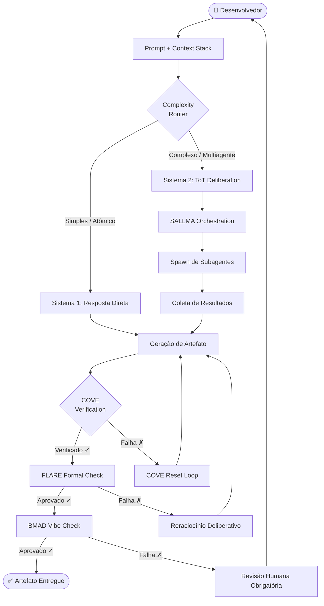
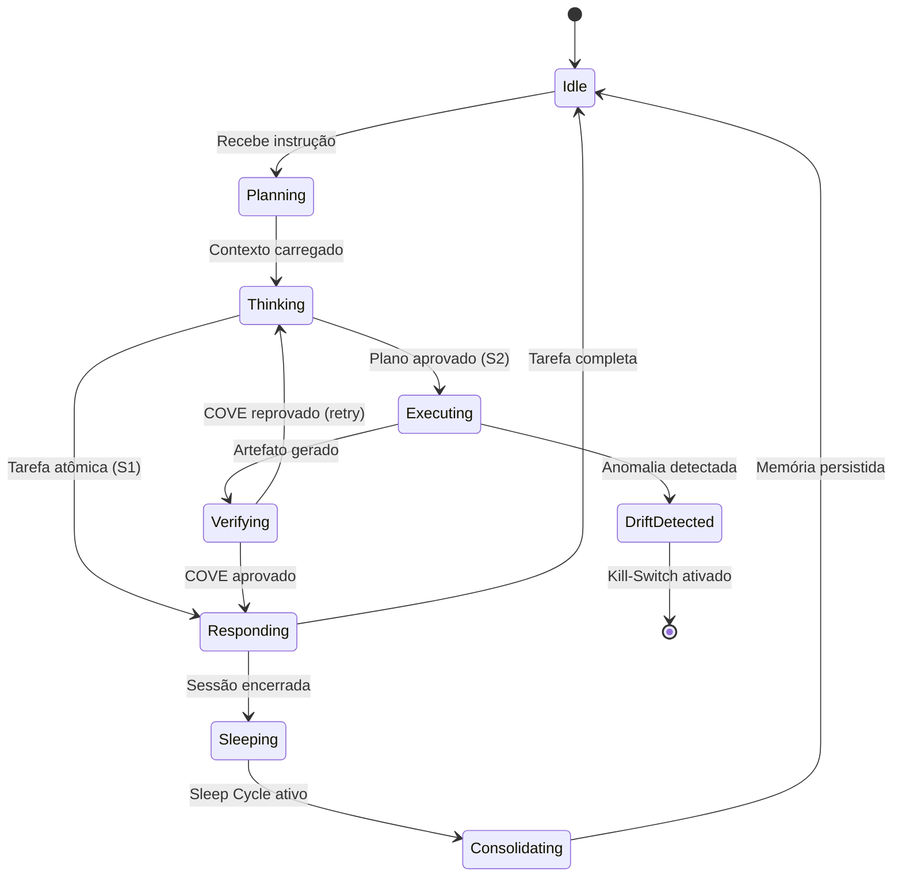
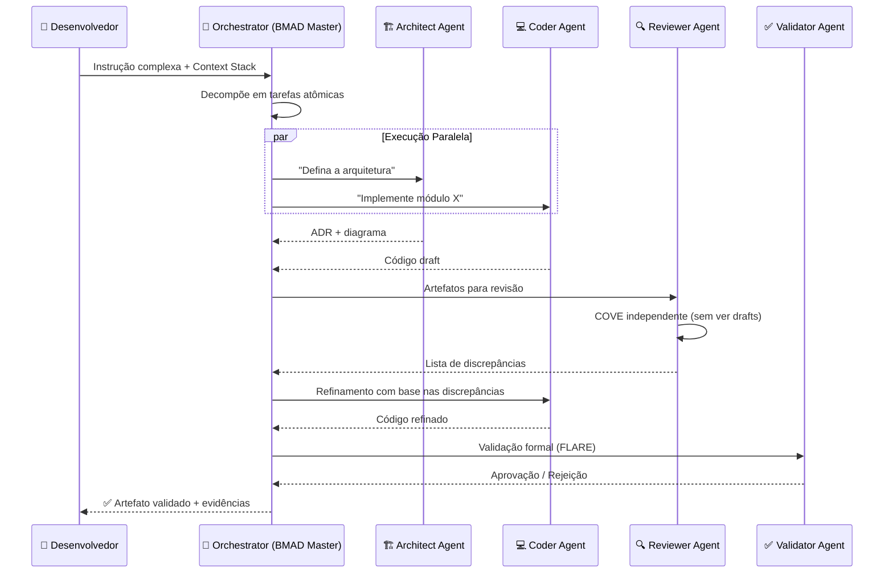
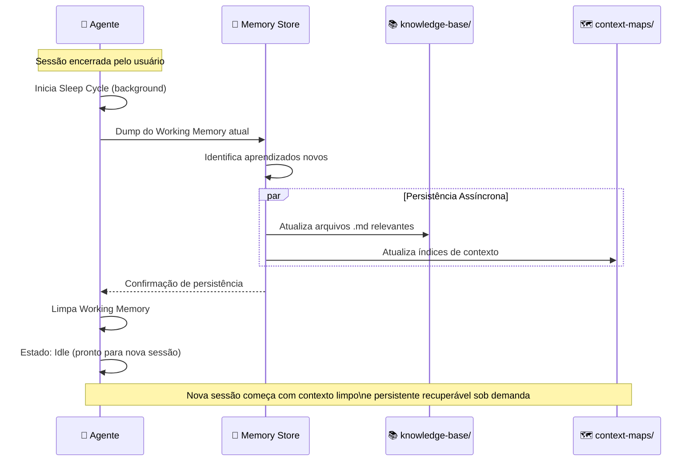

# ⚙️ EXECUTION FLOW: AgentIQ — Ciclo Cognitivo Completo

> **Padrão:** SALLMA + BMAD + FLARE  
> **Tipo:** Diagrama de Sequência + State Machine  
> **Versão:** 1.0 | 2026

---

## 1. Visão Geral do Ciclo Cognitivo

O ciclo AgentIQ descreve como a inteligência flui do **Prompt do Desenvolvedor** até a **Entrega Validada de Artefato**, passando por etapas de raciocínio System 1 → System 2.



---

## 2. Estado dos Agentes: State Machine



---

## 3. Context Stack — Ordem de Carregamento

A montagem do contexto segue a **Regra de Ouro de Posicionamento** para evitar o fenômeno "Lost-in-the-Middle":

```
┌─────────────────────────────────────────────┐
│  [TOPO — Efeito de Primazia]                │
│  1. AGENTS.md — Regras críticas e sandbox   │
│  2. GEMINI.md / CLAUDE.md — Regras motor    │
├─────────────────────────────────────────────┤
│  [MEIO — Contexto de Suporte]               │
│  3. governance/ — Princípios de engenharia  │
│  4. rules/ — Regras de domínio ativas       │
│  5. Exemplos few-shot relevantes            │
│  6. Documentação de referência              │
├─────────────────────────────────────────────┤
│  [BASE — Viés de Recência]                  │
│  7. Código/arquivo atual em foco            │
│  8. Tarefa imediata e instrução do prompt   │
└─────────────────────────────────────────────┘

LIMITE: < 32.000 tokens totais (zona segura de atenção)
ALVO IDEAL: < 8.000 tokens para sessões focadas
```

---

## 4. Fluxo SALLMA: Orquestração Multiagente

**SALLMA** (System for Adaptive Language-Led Multi-Agent Architecture) descreve como agentes especializados colaboram:



---

## 5. Ciclo BMAD: Validação por Fase

O **BMAD** (Blueprint → Make → Audit → Deploy) define os checkpoints de qualidade:

```
FASE 1: BLUEPRINT
  ├── Objetivo claro e mensurável definido?
  ├── Contexto mínimo viável montado?
  ├── Subagentes necessários identificados?
  └── Critérios de aceitação escritos?
        ↓ [Aprovado: Fase 2]

FASE 2: MAKE (Execução)
  ├── Agente está usando a stack definida?
  ├── Código segue Clean Architecture?
  ├── Cobertura de testes ≥ 80%?
  └── Commits atômicos e rastreáveis?
        ↓ [Aprovado: Fase 3]

FASE 3: AUDIT (Revisão)
  ├── COVE executado de forma fatorada?
  ├── FLARE formal check completado?
  ├── Nenhum import/API alucinado?
  └── PR com evidências de validação humana?
        ↓ [Aprovado: Fase 4]

FASE 4: DEPLOY
  ├── Testes de integração passando?
  ├── Observabilidade configurada?
  ├── Rollback plan documentado?
  └── Post-mortem template preenchido?
        ↓ [✅ Deploy autorizado]
```

---

## 6. Sleep Cycle Flow: Consolidação de Memória

Ao final de sessões longas, o agente executa o processo de consolidação assíncrona:



**Regras do Sleep Cycle:**
- NUNCA bloqueia a thread principal de interação
- Timeout máximo: 30 segundos para dump completo
- Em caso de falha: persiste em `/diagnostics/failed-dumps/` para retry manual
- Contexto consolidado fica disponível como RAG na próxima sessão

---

## 7. Raciocínio Tree of Thoughts (ToT): Sistema 2

Para tarefas de alta complexidade, o agente ativa o modo de raciocínio deliberativo:

```
ESTADO INICIAL: Problema recebido
       ↓
ATOMIZAÇÃO: Decomposição em estados menores
       ↓
EXPANSÃO (BFS/DFS):
   Ramo A: Abordagem conservadora
   Ramo B: Abordagem inovadora  
   Ramo C: Abordagem híbrida
       ↓
AVALIAÇÃO HEURÍSTICA (por ramo):
   Sure (Certo):   Caminho validado por FLARE?
   Likely (Prováv): Score de confiança > 0.7?
   Impossible:     Viola AGENTS.md? → PODA imediata
       ↓
LOOKAHEAD: Simula consequências de cada ramo (2 passos)
       ↓
SELEÇÃO: Ramo com maior score + menor risco
       ↓
EXECUÇÃO: Implementação do ramo selecionado
       ↓
BACKTRACKING: Se ramo falhar → volta ao ponto de bifurcação
```

---

## 8. Métricas de Performance do Fluxo

| Métrica | Target | Crítico |
|---|---|---|
| Tempo do ciclo Blueprint→Deploy | < 2h | > 8h |
| Tokens por ciclo completo | < 50k | > 200k |
| Taxa de aprovação COVE (1ª tentativa) | > 85% | < 60% |
| Retrabalho por FLARE (%) | < 10% | > 30% |
| MTTR de Agent Drift | < 15min | > 60min |
| Cobertura de testes dos artefatos | ≥ 80% | < 60% |

---

> **Referências:**  
> - *Framework Estratégico: Da Engenharia de Prompt à Arquitetura de Workflows Cognitivos*  
> - *Agentes de IA: Entendendo a Lógica da Autonomia Inteligente*  
> - *Protocolo Operacional: Governança de Engenharia Agêntica e Pull Requests de IA*  
> da biblioteca `c:\Dev\Docs\`
