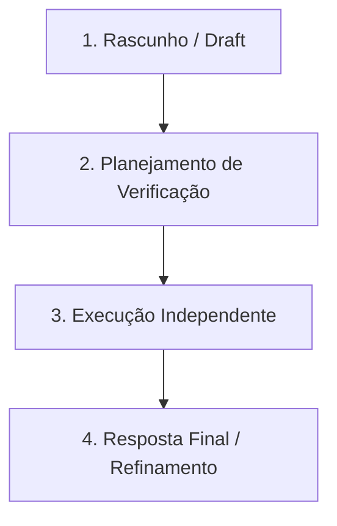

# Governança de Pull Requests Gerados por IA

Este documento estabelece as normas técnicas, filosóficas e operacionais obrigatórias para a submissão, revisão e aprovação de código gerado ou assistido por inteligência artificial no ecossistema do `agente-core`.

---

## 1. O Imperativo Estratégico: Mitigando o "Acceleration Whiplash"

A governança de inteligência artificial não é um processo burocrático de conformidade, mas sim uma blindagem operacional indispensável contra o **Acceleration Whiplash** (Efeito Chicote da Aceleração).

> [!WARNING]
> **Acceleration Whiplash**: Dados consolidados do setor apontam que a alta adoção de ferramentas de IA sem processos estritos de governança correlaciona-se diretamente com o declínio da qualidade do código de produção e com um aumento exponencial de incidentes em runtime. O ganho de velocidade inicial (vazão de código) é rapidamente anulado pelo retrabalho e por débitos técnicos complexos.

O papel deste documento é garantir que a produtividade acelerada da IA seja sustentada por portões de qualidade rigorosos, transformando a automação agêntica em um ativo estratégico estável.

---

## 2. Matriz de Responsabilidades (Human-in-the-Loop)

Para evitar o vácuo de responsabilidade comum em times que utilizam geradores automáticos de código, a autoridade e supervisão são distribuídas de acordo com a matriz abaixo:

| Papel | Responsabilidade Estrutural | Contribuição para a Qualidade (*Ground Truth*) |
| :--- | :--- | :--- |
| **Chief AI Officer (CAIO)** | Liderança estratégica, conformidade regulatória e gestão de riscos globais. | Construção de uma cultura organizacional "AI-Ready" e homologação de vendors e modelos com foco em segurança. |
| **Engineering Manager** | Orquestração de workflows de desenvolvimento e infraestrutura de CI/CD. | Definição das arquiteturas de contexto e monitoramento das ferramentas de métricas de engenharia. |
| **Desenvolvedor (Humano)** | Supervisão direta, escrita de prompts finos e validação técnica do código gerado. | **Elo final de decisão.** Nenhuma linha de código entra em produção sem que o desenvolvedor assuma a autoria intelectual e técnica. |

---

## 3. O Antipadrão de Delegação de Revisão

> [!CAUTION]
> **É estritamente proibido submeter Pull Requests (PRs) contendo código não revisado linha por linha pelo autor.**
> 
> Delegar a revisão de blocos densos de código gerado por IA para outros engenheiros humanos é um desperdício inaceitável do tempo cognitivo da equipe. Se o autor do PR não validou o código gerado, o revisor precisará realizar um esforço desproporcional. O autor do PR deve agir como o supervisor técnico primário do assistente de IA.

---

## 4. Checklist de Integridade para PRs Assistidos por IA

Todo Pull Request submetido com apoio de agentes ou copilotos deve cumprir os seguintes requisitos obrigatórios:

*   **Atomicidade Extrema:** Utilize a capacidade do agente para gerenciar branches e commits de forma granular (*Git finagling*). Os commits devem ser pequenos, focados e conter mudanças de responsabilidade única.
*   **Descrições Validadas:** É proibido utilizar notas de PR geradas por IA sem edição manual. O autor humano deve revisar e refinar o texto explicativo, garantindo que ele descreva com fidelidade técnica as mudanças arquiteturais e lógicas efetuadas.
*   **Evidências de Validação Manual:** O PR deve conter anexos de logs de execução, screenshots ou gravações em vídeo comprovando o funcionamento prático da alteração em ambiente local ou sandbox. É necessário provar que o código foi testado ativamente.
*   **Rastreabilidade de Contexto:** Devem ser incluídos links explícitos para as issues correspondentes (ex: Jira, GitHub Issues) para assegurar que a geração de código atende a um requisito de negócio delimitado e não foi criada em um vácuo conceitual.

---

## 5. Protocolo de Verificação Independente Fatorada (COVE)

Para mitigar alucinações sintáticas, lógicas e falhas de lógica em tarefas de média a alta complexidade, o agente de IA deve obrigatoriamente executar o ciclo **Chain-of-Verification (COVE)** de forma fatorada e independente:

1.  **Rascunho (Draft):** O agente gera a primeira versão do código lógico para resolver o problema proposto.
2.  **Planejamento de Verificação:** O agente elabora um conjunto de perguntas críticas e testes lógicos que validam a robustez do rascunho (ex: *"Como este código trata ponteiros nulos?"*, *"O tratamento de concorrência está imune a race conditions?"*).
3.  **Execução de Verificação Independente:** O agente responde a cada pergunta de validação isoladamente, **sem consultar diretamente o rascunho anterior**, de forma a contornar o viés de confirmação intrínseco.
4.  **Resposta Final e Refinamento:** O agente consolida o código aplicando as correções identificadas nas discrepâncias entre o rascunho e a validação independente.

---

## 6. Auditoria de Segurança e Conformidade

Todo PR aprovado deve passar por uma checagem de integridade automática no CI/CD para assegurar que não há injeções de contexto maliciosas e que todos os endpoints e chaves de APIs seguem diretrizes de "Zero Trust". A linhagem de dados e a auditoria de commits são mantidas permanentemente no histórico Git do projeto como registro de conformidade para auditorias de nível de maturidade empresarial.
