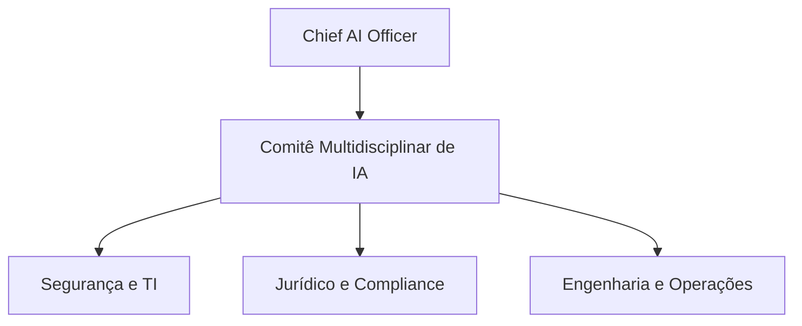

# Manual de Governança de IA para Líderes C-Suite

Este documento estabelece as diretrizes estratégicas e a governança corporativa necessárias para a implantação, sustentabilidade e gestão de riscos de sistemas baseados em Inteligência Artificial em escala empresarial dentro do ecossistema `agente-core`.

---

## 1. O Imperativo da Responsabilidade Executiva

No cenário tecnológico de 2026, a Inteligência Artificial deixou de ser uma iniciativa experimental isolada para se tornar o core operacional das empresas. Com isso, os líderes C-Suite (CFO, CTO, CEO) enfrentam cobranças severas quanto ao Retorno sobre Investimento (ROI) e à conformidade de segurança pós-quântica e regulatória (como o *EU AI Act* e o *NIST AI RMF*).

> [!IMPORTANT]
> **A IA não é uma mera atualização de software.** Delegar sua governança inteiramente ao departamento de TI é um erro grave de gestão. A governança de IA é um diferencial de negócios que protege a integridade e reputação institucional. Organizações que adotam estruturas estruturadas relatam reduções substanciais em riscos de conformidade e ganhos substanciais em eficácia de capital.

---

## 2. A Liderança Multidisciplinar e o papel do CAIO (Chief AI Officer)

A governança começa com a centralização de responsabilidades sob um papel executivo dedicado, auxiliado por um Comitê Multidisciplinar de IA.



*   **O Chief AI Officer (CAIO):** Líder executivo responsável por guiar a estratégia corporativa de IA, alinhar investimentos, homologar plataformas de terceiros (*vendors*) e gerenciar o inventário de modelos ativos da companhia.
*   **Comitê Multidisciplinar:** Integra as verticais de **TI/Segurança** (infraestrutura e proteção contra injeções/vazamentos), **Jurídico/Compliance** (privacidade de dados e direitos autorais) e **Engenharia/Negócios** (otimização de custos e realização de valor prático).

---

## 3. Gestão e Mitigação de Riscos de Produção

### 3.1. Drift (Deriva) de Modelos e Contexto
Os modelos de linguagem operam sob probabilidade estocástica. Com o tempo, as organizações enfrentam o fenômeno do **Drift de Performance** (degradação silenciosa provocada por atualizações não notificadas nas APIs proprietárias dos provedores ou por mudanças comportamentais nos dados de entrada).
*   **Ação Recomendada:** Estabelecer *baselines* de desempenho mensuráveis e testes automatizados recorrentes para comparar as saídas do modelo atual com os dados históricos de referência.

### 3.2. A Dívida Técnica do "Fast AI Code"
A facilidade de gerar protótipos rápidos através do *Vibe Coding* gera uma falsa percepção de produtividade. Sem governança formal, o volume de código mal estruturado e sem testes cresce exponencialmente, gerando custos catastróficos de refatoração futura. 

---

## 4. O Ciclo de Vida do Sistema de IA (Censinet & NIST)

A governança estratégica exige um fluxo rigoroso para a esteira operacional dos modelos, dividido em seis fases críticas:

```
[Register] -> [Classify] -> [Implement] -> [Monitor] -> [Assure] -> [Retire]
```

1.  **Register (Registrar):** Todo modelo ou API em uso comercial deve constar no inventário corporativo central de ativos.
2.  **Classify (Classificar):** Atribuição do nível de risco regulatório e de segurança pós-quântica (baixo, médio, alto ou inaceitável).
3.  **Implement (Implementar):** Desenvolvimento do sistema ancorado por diretrizes e regras sistêmicas de segurança.
4.  **Monitor (Monitorar):** Observabilidade técnica contínua (faróis de latência, custos e taxa de alucinação em produção).
5.  **Assure (Assegurar):** Auditorias manuais periódicas efetuadas por especialistas humanos (*Human-in-the-Loop*).
6.  **Retire (Descomissionar):** Desativação segura de modelos obsoletos seguindo políticas rígidas de linhagem de dados (*Lineage Maps*) para auditorias fiscais ou judiciais retroativas.

---

## 5. Orçamento de Computação e TCO (Total Cost of Ownership)

O gerenciamento financeiro de IA exige a transição do desperdício de janelas infladas de contexto para o **MVC (Mínimo Contexto Viável)**.
*   Manter o contexto permanentemente ativo (*In-Process*) eleva exponencialmente o consumo de tokens de entrada em cada prompt simples.
*   O uso de arquiteturas externas de memória e cacheamento seletivo reduz o custo operacional e o desperdício em mais de 90%, otimizando o orçamento de computação corporativa e mitigando latências que afetam a retenção de usuários.
