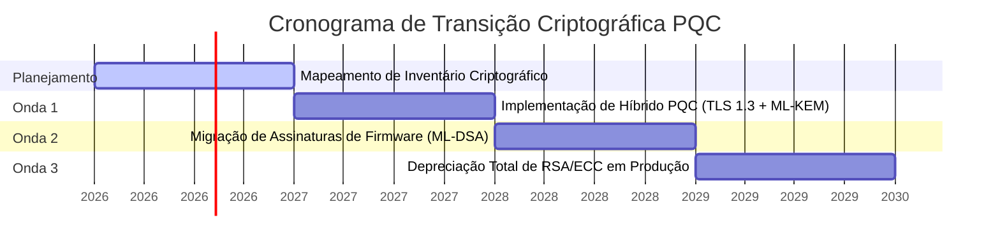

# Estratégia de Governança para Criptografia Pós-Quântica (PQC)

## 📌 Contexto e Ameaça Quântica
O avanço da computação quântica representa uma ameaça existencial aos sistemas criptográficos tradicionais de chave pública baseados em fatoração de inteiros e logaritmos discretos (como RSA, Diffie-Hellman e ECDSA). O advento de computadores quânticos em escala (capazes de executar o Algoritmo de Shor) comprometerá a integridade de comunicações históricas cifradas e assinaturas digitais ativas. 

Esta política estabelece as diretrizes estratégicas e os padrões de governança técnica para a migração corporativa sistemática para algoritmos de **Criptografia Pós-Quântica (PQC)**, garantindo a autodefesa e a resiliência a longo prazo do ecossistema de dados.

---

## 🔒 1. Padrões Criptográficos Homologados (NIST PQC Standards)

Para proteger comunicações, dados em repouso e processos de assinatura, todos os sistemas sob nossa governança devem adotar exclusivamente algoritmos resistentes a ataques quânticos homologados pelo NIST:

### 1.1. Cifras de Acordo de Chaves (KEM - Key Encapsulation Mechanism)
*   **Algoritmo Primário:** **ML-KEM (anteriormente Kyber)**.
    *   *Especificação:* Utilizar preferencialmente a variante **ML-KEM-768** (equivalente em segurança ao AES-192) ou **ML-KEM-1024** (equivalente ao AES-256) para comunicações de alta sensibilidade corporativa.
    *   *Uso:* Proteção de canais de transmissão TLS (Transport Layer Security) e estabelecimento de segredos simétricos efêmeros.

### 1.2. Assinaturas Digitais Pós-Quânticas (DSA - Digital Signature Algorithm)
*   **Algoritmo Primário:** **ML-DSA (anteriormente Dilithium)**.
    *   *Especificação:* Adotar **ML-DSA-65** ou **ML-DSA-87** para integridade de transações e autenticação de identidade.
*   **Algoritmo Alternativo (Alta Segurança/Tamanho Compacto):** **FN-DSA (Falcon)**.
    *   *Uso:* Cenários restritos de hardware ou rede onde o tamanho do payload da assinatura é um gargalo crítico de latência.
*   **Algoritmo para Assinaturas de Estado Único (Stateful Hash-Based):** **SLH-DSA (SPHINCS+)** ou **XMSS**.
    *   *Uso:* Assinaturas digitais de firmware de longo prazo, onde a robustez absoluta baseada puramente em funções hash de via única é desejada.

---

## 🛡️ 2. Autodefesa Agêntica em Runtime (Positive Security)

A governança de segurança pós-quântica exige que os agentes cognitivos que operam no framework atuem sob o modelo de **Positive Security** (Segurança Positiva):

1.  **Sandbox de Privilégios Mínimos (Least Privilege):** Os agentes cognitivos executam operações sob restrições físicas rígidas especificadas na tag local de governança em `SKILL.md`. Qualquer tentativa de ler diretórios não autorizados ou invocar processos do sistema externo sem consentimento é abortada em tempo de compilação.
2.  **Cripto-Agilidade Reativa:** Arquiteturas de código geradas pelos agentes devem ser programadas para serem cripto-ágeis. Funções de cifragem não devem ter algoritmos "hardcoded"; ao invés disso, devem consumir abstrações de fábrica (factories) que permitam a troca transparente de primitivas criptográficas sem quebrar a API pública do módulo.
3.  **Detecção de Entropia Anômala:** Monitorar em runtime tentativas de injeção de dados maliciosos ou ataques de quebra de assinatura digital quântica através da medição de desvios de integridade no fluxo de execução do agente.

---

## 📅 3. Cronograma de Migração Estratégica

A transição de infraestrutura criptográfica segue a metodologia de transição em três ondas (SND - Store Now, Decrypt Later prevention):

1.  **Mapeamento de Inventário (Onda 0 - Ativa):** Identificar todos os segredos, chaves públicas, certificados TLS e dados sensíveis arquivados expostos a algoritmos obsoletos.
2.  **Transição Híbrida (Onda 1):** Utilizar sistemas híbridos combinando criptografia clássica (ECDH) com PQC (ML-KEM) nas conexões de tráfego ativo de rede para garantir conformidade e mitigar riscos de implementação inicial.
3.  **Substituição Total (Onda 2 & 3):** Substituição progressiva de identidades digitais legadas e desativação total de algoritmos clássicos fracos frente a computadores quânticos.
