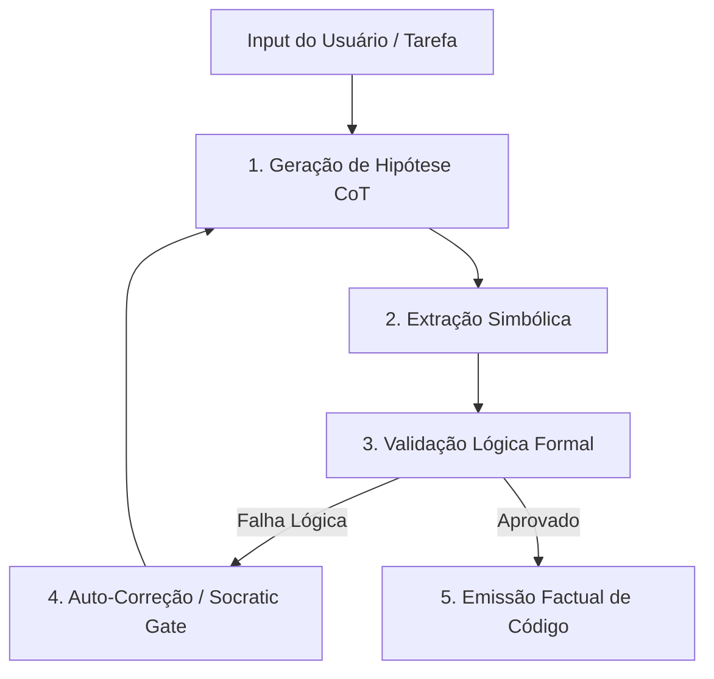

# Metodologia FLARE: Faithful Logic-Aided Reasoning and Exploration

## 📌 Introdução ao FLARE
Os Grandes Modelos de Linguagem (LLMs) são tradicionalmente motores autoregressivos baseados na previsão estatística do "próximo token" (*Next-Token Prediction*). Embora excepcionalmente potentes para tarefas criativas e síntese linguística, essa natureza probabilística os torna inerentemente propensos a desvios lógicos e alucinações técnicas sob condições de contorno complexas.

O **FLARE (Faithful Logic-Aided Reasoning and Exploration)** é um framework neuro-simbólico que atua como uma **camada de validação lógica explícita** acoplada ao processo de inferência da IA. A metodologia exige que o agente formalize, verifique e comprove seus pensamentos contra uma gramática ou estrutura lógica simbólica formal antes da emissão de qualquer código ou tomada de decisão arquitetural.

---

## ⚙️ 1. O Pipeline Cognitivo do FLARE

O fluxo de processamento de raciocínio sob a metodologia FLARE é estruturado em cinco etapas sequenciais rigorosas, eliminando o viés probabilístico puro:



1.  **Geração de Hipótese (Chain-of-Thought):** O agente gera uma hipótese inicial de resolução em linguagem natural no rascunho de raciocínio (`<thought>`).
2.  **Extração Simbólica:** O agente converte as premissas e dependências técnicas em declarações e regras lógicas formais de primeira ordem (axiomas, pré-condições, pós-condições).
3.  **Validação Lógica Formal (`<logic_check>`):** As restrições e o código propostos são avaliados contra a gramática de autodefesa do repositório para verificar contradições, furos de escopo ou violações de APIs existentes.
4.  **Auto-Correção (Self-Correction):** Se qualquer inconsistência ou quebra for detectada, o agente aciona o *Socratic Gate*, descarta a árvore lógica defeituosa, recalibra as premissas e gera uma nova hipótese.
5.  **Emissão Factual:** Apenas após a validação lógica passar com sucesso total, o código canônico ou a recomendação técnica final é impressa para o usuário.

---

## 🛠️ 2. Aplicação Prática no Ciclo de Código

Na engenharia de software, o FLARE é utilizado para validar a correção de refatorações de código de forma matemática e estrita antes do build local.

### Exemplo de Aplicação: Refatoração de Assinatura de Função

#### A. Premissas Simbólicas Extraídas:
*   $P_1$: A função `getUserData(userId: string)` é exportada e consumida por 5 módulos.
*   $P_2$: A nova assinatura exige um parâmetro opcional `options: QueryOptions`.
*   $P_3$: Se a assinatura for modificada sem compatibilidade reversa ou atualização de dependências, o build quebrará (Violação do Princípio Fail-Fast).

#### B. Execução do `<logic_check>` em Contexto:
```xml
<thought>
Premissa: Alterar assinatura de getUserData em auth.ts.
Dependências afetadas detectadas via grep:
- modules/profile.ts: L45
- modules/billing.ts: L12
- modules/dashboard.ts: L89
Decisão: Manter compatibilidade reversa aceitando `options?: QueryOptions` ou realizar refatoração contígua em todos os arquivos identificados.
</thought>
<logic_check>
- Teste lógico de dependências: modules/profile.ts adaptado para assinatura híbrida.
- Teste lógico de compatibilidade: auth.ts retorna undefined para options ausentes de forma segura.
Resultado: APROVADO.
</logic_check>
```

---

## 🛡️ 3. Mitigação do Viés Probabilístico

O framework FLARE neutraliza ativamente três patologias cognitivas clássicas de LLMs:

| Patologia Cognitiva | Causa Estatística | Mitigação FLARE |
| :--- | :--- | :--- |
| **Alucinação de APIs** | Frequência estatística de nomes plausíveis em pesos de treino legados. | **RdR (Retrieval-driven Reasoning):** Validação estrita do arquivo contra o catálogo real de skills e o índice semântico ativo do repositório. |
| **Perda de Atenção (Lost-in-the-Middle)** | Atenção dispersa em contextos longos acima de 32k tokens. | **MVC (Minimum Viable Context):** Contenção de tokens contextuais e isolamento de dependências atômicas via tags XML explícitas. |
| **Complacência de Resposta** | O LLM concorda com premissas de design erradas propostas pelo usuário para fechar o diálogo. | **Socratic Gate:** O agente suspende a geração de código e questiona ativamente o usuário caso as premissas violem as leis imutáveis P0/P1 do repositório. |
