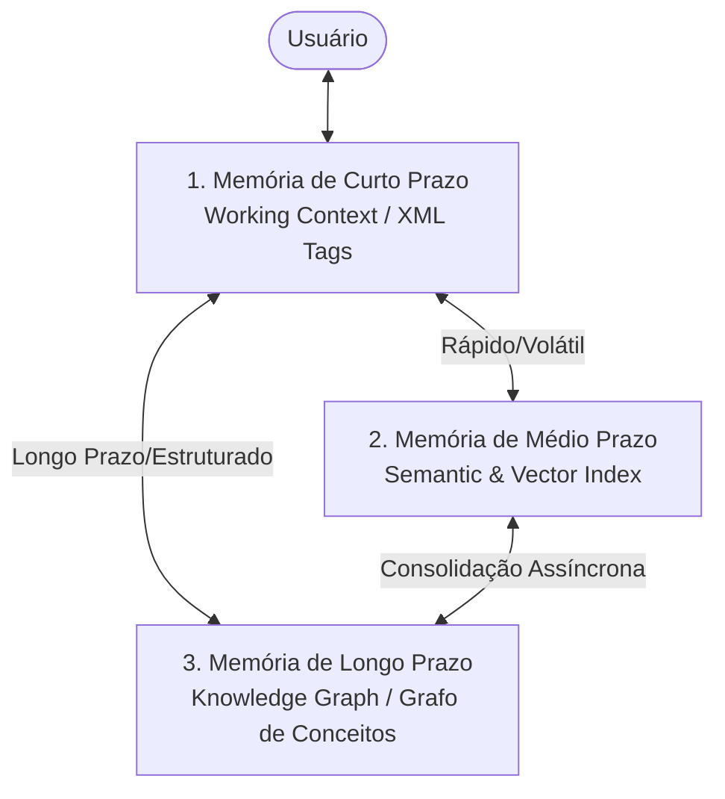

# Padrões e Topologias de Memória para Sistemas Multiagentes

## 📌 Visão Geral
Para realizar tarefas complexas e de longo prazo sem perder a coerência contextual, sistemas multiagentes avançados exigem uma arquitetura de persistência e recuperação estruturada. A dependência exclusiva da janela de contexto nativa dos LLMs expõe o sistema a gargalos de latência, custos financeiros redundantes e perda progressiva de atenção (*attention decay*).

Este padrão estabelece a **Topologia de Memória Tripartite**, definindo o particionamento estrito entre memória de curto prazo (*working memory*), memória de médio prazo (*episodic/semantic memory*) e memória de longo prazo (*conceptual/structural memory*).

---

## 🗺️ 1. Arquitetura da Topologia de Memória Tripartite

A persistência cognitiva é dividida em três níveis especializados com dinâmicas de leitura/escrita e latências distintas:



### 1.1. Memória de Curto Prazo (Working Context)
*   **Definição:** O estado volátil e imediato do agente durante uma única sessão ou turnos de conversação.
*   **Mecanismo:** Tags XML explícitas (`<thought>`, `<logic_check>`, `<error>`), histórico imediato de mensagens no prompt e buffers de variáveis temporárias.
*   **Latência:** Instante ($0\text{ ms}$ de overhead de busca).
*   **Estratégia de Limpeza:** Descartada ou resumida dinamicamente quando a janela atinge limites de segurança (por exemplo, 80% do token count limite).

### 1.2. Memória de Médio Prazo (Semantic/Episodic Memory)
*   **Definição:** Histórico recente e episódios passados de interação que contêm informações contextuais úteis para a tarefa em andamento.
*   **Mecanismo:** Banco de dados vetorial (Vector DB) com embeddings semânticos. A busca é feita por similaridade de cosseno a partir do input atual do usuário.
*   **Latência:** Média ($20\text{ ms} - 100\text{ ms}$).
*   **Estratégia de Sincronização:** Escrita em lote assíncrona ao final de cada execução bem-sucedida de tarefa (pipeline de checkpointing).

### 1.3. Memória de Longo Prazo (Conceptual/Knowledge Graph)
*   **Definição:** Fatos imutáveis, regras de negócio do repositório, dependências de pacotes e a árvore estrutural do ecossistema.
*   **Mecanismo:** Grafo de Conhecimento (*Knowledge Graph*) com conexões explícitas do tipo Entidade-Relação-Entidade.
*   **Latência:** Variável de acordo com a profundidade do caminho percorrido no grafo.
*   **Uso Primário:** Resolução de dependências arquiteturais complexas e governança corporativa de código.

---

## 📈 2. Fluxo de Consolidação de Memória (Sleep Cycles)

As informações fluem da memória de curto prazo para os níveis de persistência mais profundos através de um pipeline assíncrono de **Consolidação de Memória**, inspirado em ciclos biológicos de sono:

```
[Sessão de Conversa] 
       │ 
       ▼ (Passagem de turnos / Conclusão da tarefa)
[Extração de Fatos] -> O agente analisa a conversa buscando decisões técnicas importantes.
       │
       ├─► [Indexação Vetorial] ──► (Escrita na Memória de Médio Prazo)
       │
       └─► [Extração de Tríades] ──► (Inserção no Grafo de Conhecimento - Longo Prazo)
```

1.  **Geração do Episódio:** Ao finalizar uma sessão com o usuário, o framework dispara um job em segundo plano.
2.  **Destilação de Aprendizados:** Um agente de auditoria extrai aprendizados chave, decisões tomadas e padrões criados na sessão.
3.  **Embeddings e Tríades:** 
    *   O aprendizado é convertido em vetor e indexado no banco vetorial corporativo.
    *   Se for um conceito fixo ou regra estrutural, é gerado uma tríade RDF (Exemplo: `[agente-core] -> [utiliza] -> [ML-KEM]`) e injetado no grafo de conhecimento global.

---

## 🛡️ 3. Governança e Segurança de Dados na Memória (Sanitization)

A manipulação de memórias persistentes corporativas é altamente regulada para evitar injeções ou vazamentos de dados confidenciais:

1.  **Sanitização Automática de PII (Personally Identifiable Information):** Filtros heurísticos que removem chaves de API, senhas, CPFs, e-mails ou tokens confidenciais antes do processo de embedding ou persistência de médio/longo prazo.
2.  **TTL (Time-To-Live) Dinâmico:** Memórias de médio prazo expiram ou reduzem o peso de relevância caso não sejam invocadas em consultas semânticas por mais de 30 dias.
3.  **Isolamento Multitenant:** Memórias coletadas em projetos ou namespaces distintos nunca se cruzam. Chaves de criptografia exclusivas baseadas em chaves simétricas pós-quânticas protegem os dados vetoriais de cada cliente.
