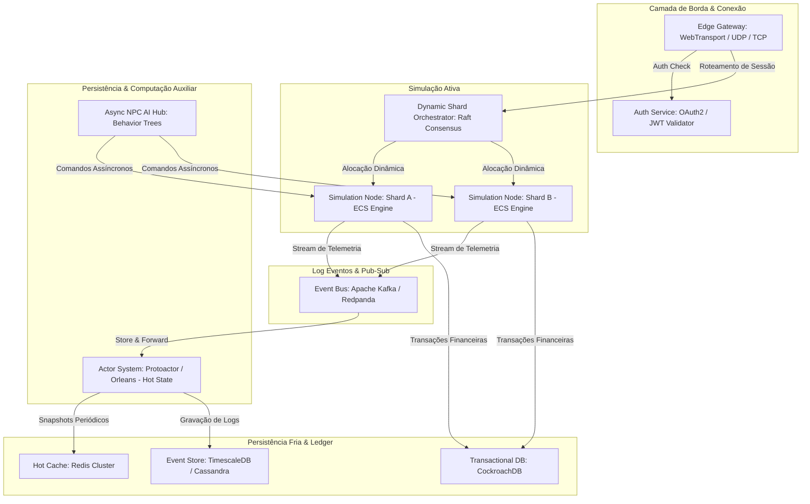

# 📘 ESPECIFICAÇÃO TÉCNICA E ARQUITETURA DE SISTEMA (SÊNIOR)
## Projeto: MMO Sandbox Persistente em Tempo Real (High-Scale Distributed System)

**Status:** Ready for Implementation / RFC  
**Escopo:** Arquitetura de Software Sênior e Design de Infraestrutura Distribuída  
**Público-alvo:** Staff Engineers, Arquitetos de Sistemas Distribuídos e Engenheiros de Concorrência  

---

## 1. Visão Geral do Sistema (System Archetype)

Este documento define a arquitetura de um **jogo multiplayer online massivo (MMO) sandbox persistente** baseado em um modelo **authoritative server**. O sistema opera como um ambiente virtual distribuído e descentralizado, orientado a eventos, de baixa latência e com persistência de estado tolerante a falhas parciais. 

O design de software adota padrões de **Event Sourcing**, **CQRS (Command Query Responsibility Segregation)**, **Actor Model** para gerência de concorrência e **Entity Component System (ECS)** para a modelagem lógica do mundo.

---

## 2. Objetivos Não-Funcionais & SLAs de Sistema (System SLOs)

O sistema deve ser construído respeitando as métricas operacionais abaixo sob carga de pico:

| Métrica | Meta (SLO) | Observações |
| :--- | :--- | :--- |
| **Capacidade por Cluster** | $\ge 10.000$ CCU (Concorrência Ativa) | Sem degradação de performance por região geográfica. |
| **Tick Rate da Simulação** | $20\text{ Hz}$ ($50\text{ ms}$ por tick) | Tolerância de jitter máxima de $\pm 2\text{ ms}$. |
| **Orçamento de Latência RTT** | $< 100\text{ ms}$ para ações críticas | PvP, colisão e movimentação tática. |
| **Disponibilidade (Gateway)**| $\ge 99,99\%$ | Alta disponibilidade via Active-Active edge routing. |
| **Consistência de Transação** | ACID Estrito (Ledger de Inventário) | Consistência eventual tolerada apenas para estados não-críticos (ex: cosméticos visuais). |
| **Throughput de Eventos** | $\ge 200.000\text{ msg/s}$ | Taxa de processamento agregada do Event Bus central. |

---

## 3. Topologia de Microserviços & Componentes Principais



### 3.1. Edge Gateways (Connection Manager)
*   **Protocolo:** Implementação híbrida de **WebTransport** (via UDP/QUIC para transmissão rápida não-confiável) e **WebSockets** (com fallback HTTP/2/3 para tráfego TCP confiável).
*   **Responsabilidade:** Manter a tabela de conexões ativas (Connection State Table), descriptografar payloads TLS 1.3, validar JWTs e aplicar limites de taxa (*Token Bucket Algorithm*) por IP e ID de conta.
*   **Gateway Routing:** Roteia os pacotes diretamente ao nó do Shard responsável usando hashing consistente espacial.

### 3.2. Sharding Dinâmico (Dynamic Spatial Partitioning Node)
*   **Orquestração:** O mundo é particionado dinamicamente via **Quadtrees** baseadas em densidade populacional local. Quando uma região espacial excede 500 entidades ativas, ela se subdivide em shards filhos executados em processos separados.
*   **Cross-Shard Handovers:** Quando uma entidade cruza os limites geográficos de um shard, sua posse de estado é transferida via um protocolo de handshake em duas fases (2-Phase Handshake) orquestrado por um coordenador Raft, minimizando *freezeframes*.

### 3.3. Motor de Simulação do Mundo (ECS Simulation Engine)
*   **Paradigma:** Implementado sob arquitetura **Entity Component System (ECS)** para otimização de localidade de CPU cache (Cache-friendly Memory Layout).
*   **Ticks Determinísticos:** Loop central baseado em acumulador de tempo rígido (*Fixed Timestep*). O processamento de física e cálculo de navegação (NavMesh) é isolado em sistemas ECS desacoplados que operam a $20\text{ Hz}$.

### 3.4. State Persistence & Actor Model (Hot State Store)
*   **Modelo de Concorrência:** Uso do **Actor Model** (ex: Akka.NET, Protoactor ou Orleans) para gerenciar o estado mutável em memória dos jogadores e NPCs. Cada entidade do jogo é representada por um ator único que processa mensagens de forma sequencial, eliminando concorrência por locks tradicionais de banco de dados.
*   **Cold Storage & Logs:** Periodicamente (a cada 5 minutos), os atores persistem seu snapshot compactado de estado no Redis Cluster e enviam o log delta de ações para armazenamento em banco de dados analítico de alta escrita (Cassandra/TimescaleDB).

---

## 4. Fluxo de Dados & Comunicação em Tempo Real

```mermaid
sequenceDiagram
    autonumber
    participant C as Client (Prediction Engine)
    participant GW as Edge Gateway
    participant SH as Shard Node (ECS Sim)
    participant EB as Kafka Event Bus
    participant AS as Actor System (Hot State)
    participant DB as CockroachDB (Ledger)

    C->>GW: 1. Ação do Jogador (ex: ATTAQUE_CMD, Protobuf)
    GW->>GW: Valida Taxa de Envio & Assinatura Digital
    GW->>SH: 2. Encaminha Comando Sanitizado
    
    rect rgb(20, 30, 40)
        Note over SH: Tick Loop Sim (50ms)
        SH->>SH: 3. Executa Detecção de Colisão e Física (Server Authoritative)
        SH->>SH: Resolve Resolução de Dano
    end
    
    SH->>EB: 4. Emite Evento COMBAT_RESOLVED
    SH->>C: 5. Envia Broadcast Delta de Estado (AoI Filtered)
    
    par Processamento Assíncrono do Evento
        EB->>AS: 6a. Atualiza Ator do Jogador (Experiência, Status)
        EB->>DB: 6b. Persiste Mudanças de Inventário / Drop de Itens (Transação ACID)
    end
    
    C->>C: 7. Executa Reconciliação Visual Local (Client Reconciliation)
```



---

## 5. Modelo de Sincronização e Mitigação de Latência

### 5.1. Padrões de Sincronização de Rede
*   **Server Authoritative Engine:** O servidor é o detentor absoluto da lógica e física. Clientes enviam comandos de entrada desprovidos de resultado (ex: `"Pressionou W"` em vez de `"Movi para (X, Y)"`).
*   **Client-Side Prediction:** O cliente executa localmente as ações de movimentação instantaneamente, assumindo aprovação do servidor para evitar sensação de *lag*.
*   **Server Reconciliation:** Se a resposta do servidor divergir da coordenada simulada pelo cliente localmente, o cliente executa um retrocesso (*rewind*) ao último estado conhecido do servidor e reexecuta todas as entradas não confirmadas.
*   **Lag Compensation (Rollback Physics):** O servidor armazena um buffer circular das posições de todas as entidades dos últimos $500\text{ ms}$. Ao calcular um acerto (colisão/tiro), o servidor retrocede a física do mundo para o exato momento em que o cliente disparou a ação com base no timestamp do cliente, eliminando a necessidade de "atirar à frente" do alvo.

### 5.2. Otimização de Banda e Payload
*   **Interest Management (Area of Interest - AoI):** O mundo é dividido em grades de hash espacial (Spatial Hash Grid). Clientes apenas recebem dados de movimentação e telemetria de entidades localizadas dentro de seu raio de visão dinâmico (ex: círculo de $100\text{ metros}$).
*   **Delta Compression:** Em vez de enviar o estado completo do mundo a cada tick, o servidor calcula a diferença (diff) binária em relação ao último tick reconhecido pelo cliente.
*   **Serialização de Baixa Latência:** Uso exclusivo de **Protocol Buffers (Protobuf)** ou **FlatBuffers** para empacotamento binário. JSON é estritamente proibido na camada de simulação em tempo real.

---

## 6. Economia Distribuída e Sistema de Transações (Ledger Engine)

### 6.1. Garantias Transacionais
O mercado interno de trades e leilões opera sob o padrão **Saga Pattern (Orchestrator-based)** para gerenciar transações distribuídas sem bloqueios prolongados em bancos de dados distribuídos.

*   **Isolation Level:** Todas as transações que alteram inventário, saldo de ouro ou propriedade de terras executam em ambiente com nível de isolamento **Serializable** no CockroachDB.
*   **Idempotency Matrix:** Cada comando de transação deve incluir obrigatoriamente um UUIDv4 único gerado na borda como `idempotency_key` para mitigar problemas de reenvio de pacotes de rede (Network Retries).

```sql
-- Exemplo de Transação Segura de Transferência de Ativos
BEGIN;
  -- Valida fundos e bloqueia registro do comprador (Pessimistic Locking controlado)
  SELECT gold_balance FROM player_ledger 
  WHERE player_id = 'buyer_999' FOR UPDATE;
  
  -- Insere na tabela de transações garantindo idempotência
  INSERT INTO economy_transactions (transaction_id, buyer_id, seller_id, item_instance_id, cost)
  VALUES ('tx_unique_snowflake_10293', 'buyer_999', 'seller_111', 'item_instance_444', 1500)
  ON CONFLICT (transaction_id) DO NOTHING;

  -- Ajusta saldos caso a inserção ocorra com sucesso
  UPDATE player_ledger SET gold_balance = gold_balance - 1500 WHERE player_id = 'buyer_999';
  UPDATE player_ledger SET gold_balance = gold_balance + 1500 WHERE player_id = 'seller_111';
COMMIT;
```

---

## 7. Sistema de IA Autônoma Assíncrona (Agent Hub)

*   **Arquitetura Decoplada:** NPCs executam IA baseada em combinações de **Behavior Trees** de alto desempenho e **Utility AI** em um microsserviço apartado.
*   **Simulação Reativa:** A IA não roda no thread principal do tick de jogo de $20\text{ Hz}$. Em vez disso, os agentes ouvem tópicos de eventos do Kafka (ex: `PLAYER_DETECTED`, `RESOURCE_DEPLETED`) e publicam comandos de ação (ex: `NPC_PATH_FIND_CMD`) que são validados no próximo tick da simulação do shard correspondente.

---

## 8. Segurança, Threat Modeling e Anti-Cheat

*   **NavMesh Authority:** O servidor calcula colisões e navegação usando malhas 3D estritas (NavMesh) compiladas nativamente. Nenhum dado de colisão ou layout de mapa vindo do cliente é aceito para tomada de decisão física.
*   **Heuristic Outlier Detection (ML-Ready):** Pipeline analítico acoplado ao Event Bus que monitora:
    *   Gradiente de aceleração de entidades (velocidade instantânea excedendo limites físicos teóricos).
    *   Input Frequency: Teclado/Mouse gerando padrões não-humanos ou frequências que violam limites físicos do jogo.
*   **Secure Time Protocol:** O tempo de simulação de jogo é controlado inteiramente pelo servidor de relógio mestre (Grandmaster Clock Server) sincronizado via NTP local no cluster de servidores de borda.

---

## 9. Plano de Recuperação de Falhas (Disaster Recovery & HA)

*   **Event Sourcing Recovery:** Se um shard falhar catastroficamente no meio de uma simulação:
    1. O orquestrador Kubernetes inicia uma nova réplica do pod do Shard.
    2. O novo pod carrega o último snapshot compactado persistido no Redis (máximo $5\text{ minutos}$ de atraso).
    3. O Shard consome os eventos acumulados no tópico de replay do Kafka a partir do timestamp do snapshot para reconstruir o estado com consistência de 100%.
*   **Network Partition Resilience (Split-Brain Mitigation):** Nós de simulação mantêm conexões persistentes entre si em um anel de consenso gerenciado por um cluster etcd/Raft interno. Caso uma rede se fragmente, a menor partição desliga suas simulações de forma autônoma para prevenir divergência de estado (*Desincronização de Mundo*).

---

## 10. Especificações de Schema de Eventos (Protocol Buffers)

Abaixo está a definição de mensagens estruturadas para comunicação de alta densidade no sistema:

```protobuf
syntax = "proto3";

package mmo.network.v1;

option go_package = "github.com/mmo-sandbox/core/gen/v1;networkv1";
option csharp_namespace = "MMO.Network.V1";

// Mensagem envelope que encapsula payloads enviados via WebTransport
message GamePacket {
  uint64 packet_id = 1;
  uint64 timestamp_utc_ms = 2;
  string player_session_token = 3;
  
  oneof payload {
    PlayerMovementInput movement_input = 4;
    PlayerAttackInput attack_input = 5;
    TradeProposalInput trade_proposal = 6;
  }
}

message PlayerMovementInput {
  float position_x = 1;
  float position_y = 2;
  float position_z = 3;
  float vector_x = 4;
  float vector_y = 5;
  float vector_z = 6;
  uint32 input_sequence = 7;
}

message PlayerAttackInput {
  string target_entity_id = 1;
  string skill_id = 2;
  uint32 client_tick = 3;
}

message TradeProposalInput {
  string destination_player_id = 1;
  string idempotency_key = 2;
  repeated string item_instance_ids = 3;
  uint64 gold_amount = 4;
}

// Mensagem enviada pelo servidor para replicação de estado no cliente (AoI broadcast)
message WorldStateBroadcast {
  uint32 server_tick = 1;
  uint64 server_time_ms = 2;
  
  repeated EntityState updates = 3;
  repeated string destroyed_entity_ids = 4;
}

message EntityState {
  string entity_id = 1;
  float pos_x = 2;
  float pos_y = 3;
  float pos_z = 4;
  float rot_yaw = 5;
  
  // Componentes compactados de forma dinâmica
  bytes serialized_ecs_components = 6; 
}
```

---

## 11. Critérios de Sucesso E2E & Validação de Carga

O sistema é considerado estável e pronto para produção se passar nos seguintes testes automatizados:

1.  **Chaos Mesh Injection:** Simulação de queda aleatória de $15\%$ dos nós simuladores de shards durante pico de concorrência com tempo de recuperação total de cada nó (recuperação de estado via replay Kafka) $< 4.5\text{ segundos}$ sem perda de consistência transacional no banco de dados.
2.  **Load Test (JMeter/K6):** Geração de $12.000$ conexões concorrentes simulando atividade real de movimentação e combate a uma taxa média de $25\text{ ações/segundo}$ por usuário, com CPU de gateways se mantendo abaixo de $65\%$ e latência P99 geral $< 80\text{ ms}$.
3.  **Strict Security Audit:** Zero falhas de duplicação de itens nos testes de concorrência massiva de trades com latência injetada de rede de $300\text{ ms}$.
